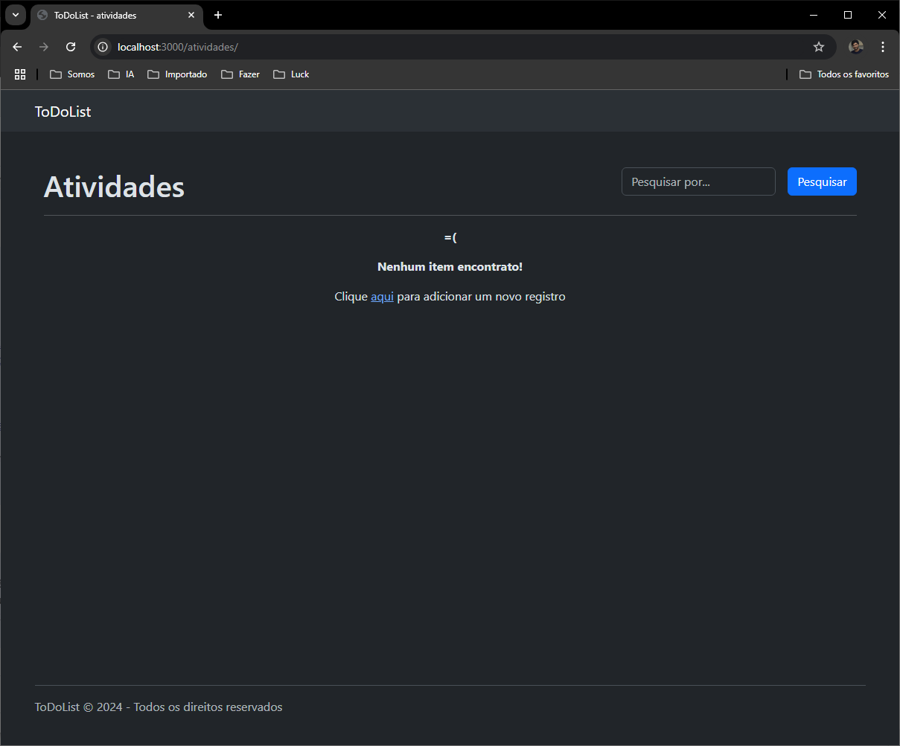
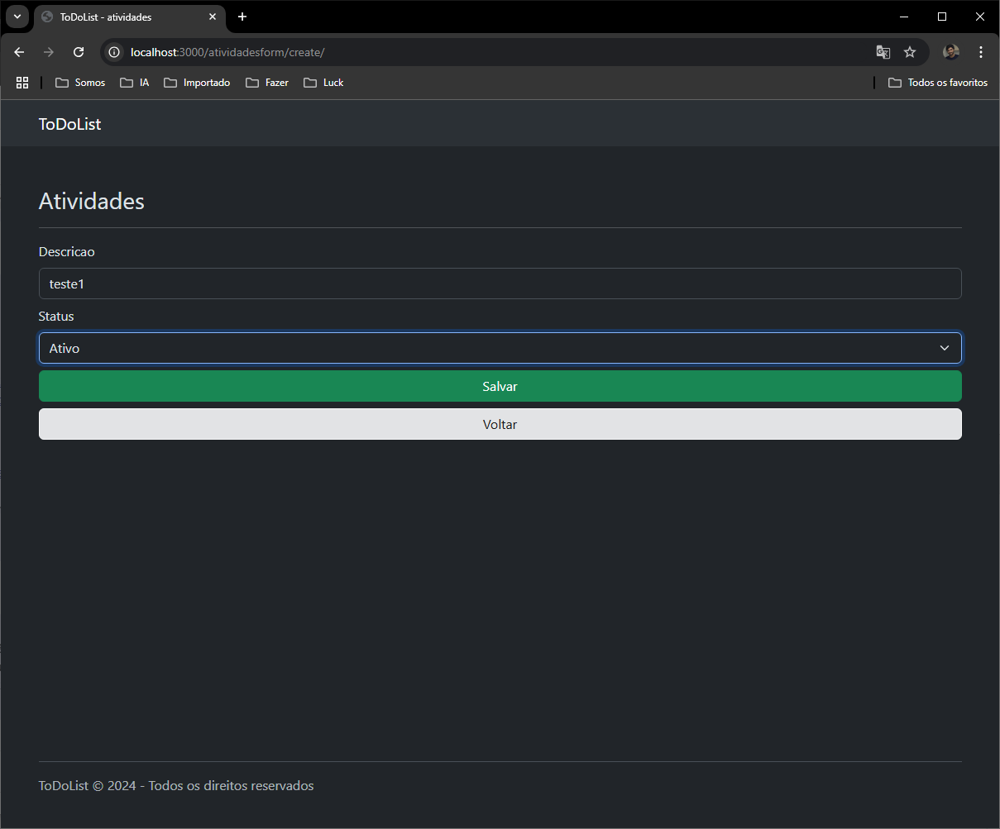

# 📝 ToDo List - Flask App

Aplicativo web simples de lista de tarefas criado com [Flask](https://flask.palletsprojects.com/), utilizando uma arquitetura organizada por blueprints e templates.

## 🔧 Funcionalidades
- Listar, pesquisar, adicionar, altear e apagar tarefas
- Organização modular com Blueprints
- Interface com HTML, CSS e JS
- Banco de dados SQLite integrado

## 🚀 Tecnologias
- Python 3.x
- Flask
- SQLite
- HTML5 + CSS3 + JavaScript

## 📁 Estrutura do Projeto
```
📦 ToDoList_Flask\
│
├── app\
│   ├── blueprint\
│   |   ├── atividades\
|   |   |   └── __init__.py
│   |   ├── atividadesform\
|   |   |   └── __init__.py
│   |   └── home\
|   |       └── __init__.py
│   ├── config\
│   |   ├── __config__.py
│   |   ├── __db__.py
│   |   ├── __email__.py
│   |   ├── __rate_limiter__.py
│   |   └── __utils__.py
│   ├── static\
│   |   ├── css\
│   |   |   └── base.css
|   |   ├── js\
│   |       └── base.js
│   ├── templates\
│   |   ├── atividades\
|   |   |   └── index.html
│   |   ├── atividadesform\
|   |   |   └── index.html
│   |   ├── home\
|   |   |   └── index.html
|   |   └── base.html
|   ├── main.py
|   └── requirements.txt
└── .gitignore

```

## ▶️ Como rodar

1. Clone o repositório:
   ```bash
   git clone https://github.com/claudiotorresarbe/ToDoList_Flask.git
   cd ToDoList_Flask
   ```

2. Crie e ative um ambiente virtual:
   ```bash
   python -m venv env
   source env/bin/activate  # Linux/macOS
   env\Scripts\activate     # Windows
   ```

3. Instale as dependências:
   ```bash
   pip install -r app\requirements.txt
   ```

4. Rode o app:
   ```bash
   python app\main.py
   ```

## 📸 Imagens
Imagem ao iniciar, sem dados na base.


Imagem do formulário.


Imagem da lista com dados.


## 📄 Licença
Este projeto é de uso livre para fins educacionais e de portfólio.
